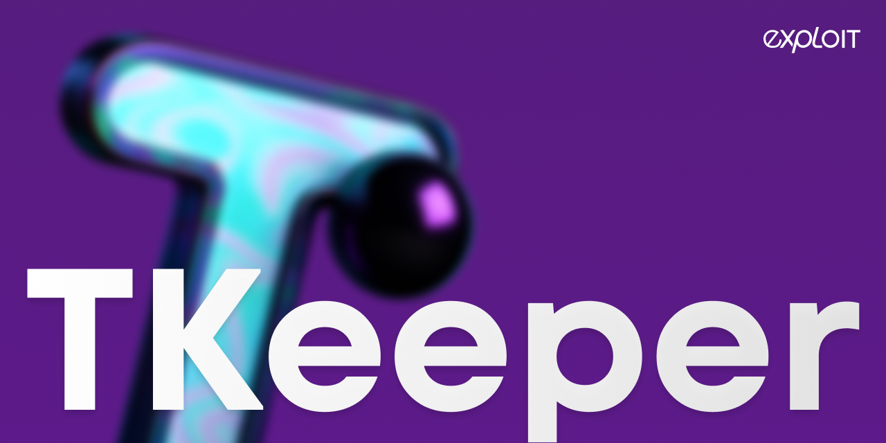

**TKeeper** is a threshold cryptographic engine that provides a simple REST API for:
- Distributed signing using **GG20 (Threshold ECDSA)** and **FROST (Threshold Schnorr)** protocols. 
- Distributed encryption using **ECIES** (Elliptic Curve Integrated Encryption Scheme).

The service abstracts the complexity of multiparty computation: to sign a message or generate a key, a client just needs to send a single HTTP request. Powered by [tss4j](https://github.com/exploit-org/tss4j) - our threshold cryptography library.

It is suitable for custody systems, MPC-based wallets, and backend services that require distributed key management and signing without exposing private keys to any single participant.

---

## Requirements

TKeeper depends on several native libraries for cryptographic operations. Make sure the following are installed on the system:

- [libsodium](https://github.com/jedisct1/libsodium) – used for secure memory handling and Ed25519 point ops
- [libgmp](https://gmplib.org/) – used for arbitrary-precision arithmetic (constant time for sensitive data)
- [libsecp256k1](https://github.com/bitcoin-core/secp256k1) – used for Secp256k1 point ops

Make sure these libraries are available in your environment and linked correctly.

> TKeeper doesn't require these libs on Windows x64, Linux x64, and macOS Apple Silicon, as it includes precompiled native dependencies for these platforms.

___

## Documentation
See [docs](docs) for detailed documentation, or visit [docs.exploit.org/tkeeper](https://docs.exploit.org/tkeeper) for
user-friendly view.

## License
TKeeper is licensed under the [Apache License, Version 2.0](LICENSE.md)